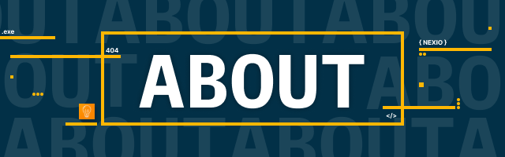

# Nexio Developer Group

Nexio Developer Group (NDG) is all about coming together to solve real-world challenges through teamwork and creativity. Every member’s contribution—no matter how small—makes a difference. By combining our efforts, we not only work toward practical solutions but also grow as individuals and as a community. Here, technology isn’t just a tool; it’s the bridge that helps us bring ideas to life, solve problems, and make a meaningful impact. Together, we learn, collaborate, and build something bigger than ourselves.

### Join Us On

### We been working on
- Web Development
- App Development
- AI/ML
- Python pip lib's
- Python Bot Development
- Database Systems
- ESP32 / Ardiuno Programming
- Server Side Programming
- Code Event's
- Much More...

### Current Leader

- [Self-Lakshh](https://github.com/Self-Lakshh)
